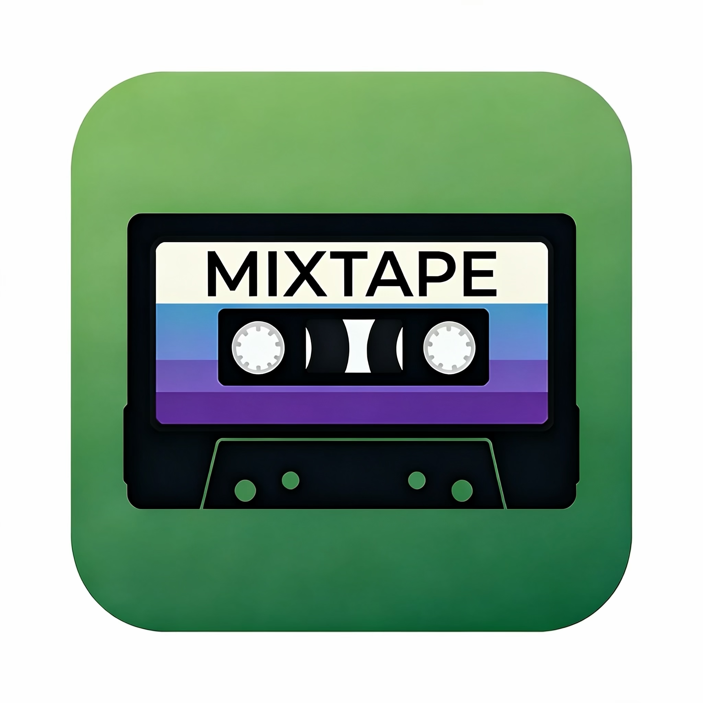
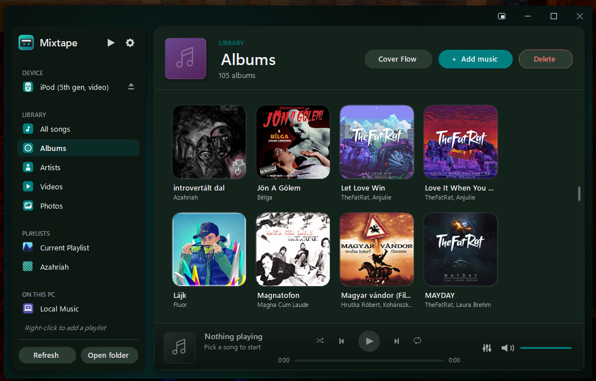
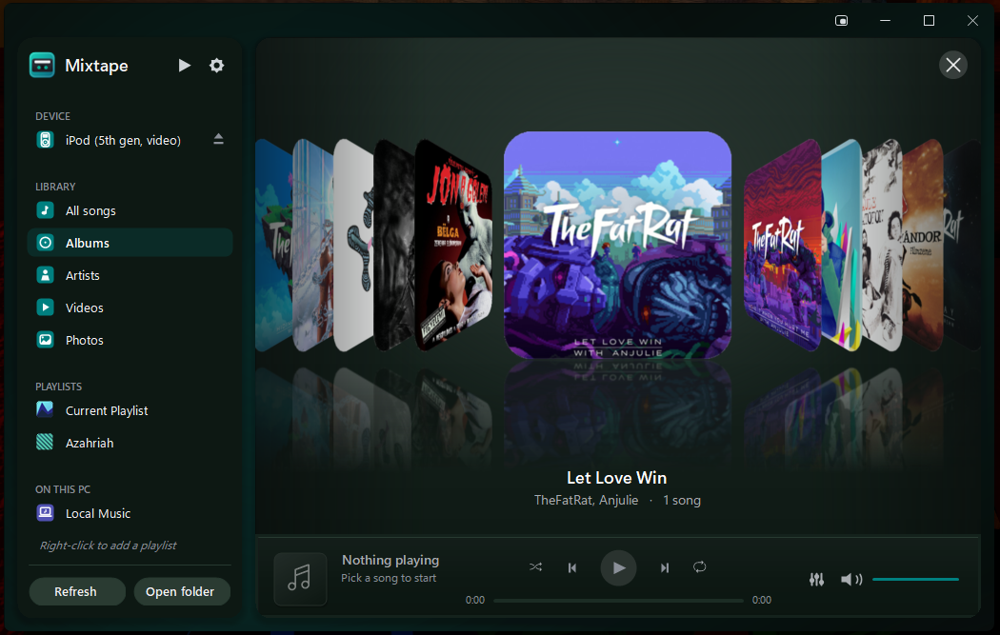

<div align="center">



# Mixtape

**Put music back on your classic iPod — no iTunes required.**

A friendly Windows app for click‑wheel iPods: copy songs, videos and photos, build playlists,
pick cover art, and play your library — by reading and writing the iPod's database directly.

[**⬇ Download**](https://github.com/fgs8z2n9qh-tech/Mixtape/releases/latest) ·
[Troubleshooting](TROUBLESHOOTING.md)

</div>



> 🤖 Made primarily with AI (Anthropic's Claude). Shared in good faith for fellow iPod owners.<br>
> ⚠️ Mixtape writes to your iPod's database. It backs up and verifies every change, but it's
> community software — keep your own backup and test with one song first.

## What it does

- 🎵 **Copy music on & off** — drag songs, videos, photos, or whole folders onto the window.
  Auto‑converts formats your iPod can't play (with FFmpeg).
- ▶️ **Built‑in player + 10‑band equalizer** — play straight from the iPod or your PC.
- 📀 **Browse by album & artist** with real cover art — including a Cover Flow view.
- 🎚️ **Make mixtapes** — create, rename and reorder playlists.
- ⭐ **Ratings, play counts, tag editing**, and cover‑art picking.
- 🔌 **Just works** — plug in and Mixtape finds your iPod, shows its model and free space, and
  on read‑only models can re‑enable writing automatically.

<p align="center">
  
</p>

## Will it work with my iPod?

Click‑wheel iPods that show up as a USB drive on Windows: **iPod 1G–5G, photo, Classic, mini, and
nano 1G–7G.**

Browsing and copying music **off** works on all of them. Copying music **on** works on every model
**except the nano 5G/6G/7G** (their newer signature isn't supported yet). iPod Touch / iPhone don't
mount as a disk and aren't supported.

## Download

Grab **`Mixtape.exe`** from the [**latest release**](https://github.com/fgs8z2n9qh-tech/Mixtape/releases/latest)
— one file, nothing to install. The first time, Windows SmartScreen may warn: **More info → Run anyway**.

Optional: install [FFmpeg](https://ffmpeg.org/) (or point to it in Settings) for audio/video transcoding.

<details>
<summary>Build it yourself (.NET 8 SDK on Windows)</summary>

```sh
git clone https://github.com/fgs8z2n9qh-tech/Mixtape.git
cd Mixtape
dotnet build -c Release
```

Run `bin\Release\net8.0-windows\Mixtape.exe`, or publish a single self‑contained file:

```sh
dotnet publish -c Release -r win-x64 --self-contained true ^
  -p:PublishSingleFile=true -p:IncludeNativeLibrariesForSelfExtract=true ^
  -p:DebugType=none -o publish
```

`IncludeNativeLibrariesForSelfExtract=true` is required — it bundles the WPF/native support
libraries inside the exe so it runs from anywhere.

</details>

## Safety

Before every change Mixtape makes a rolling backup (`iTunesDB.bak`) and a one‑time pristine backup
(`iTunesDB.original`), then re‑reads and verifies the new database and rolls back on any mismatch.
On **hash58** iPods it refuses to write unless its signature provably matches the device, so a bug
can't corrupt your library. **Restore** is on the device page. Still — back up your iPod yourself and
test with one song first; hash58 writing has had limited real‑world testing.

## Credits & license

hash58 signature tables/algorithm derived from [libgpod](http://www.gtkpod.org/libgpod/) and
ipod‑sharp (LGPL — keep that attribution); audio tags via [TagLib#](https://github.com/mono/taglib-sharp).
MIT licensed — see [LICENSE](LICENSE). Hobby project; issues and PRs welcome.
